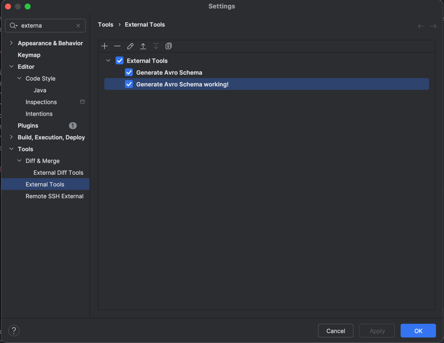

# Avro Schema Generator

## Overview

The Avro Schema Generator is a utility tool that automatically converts Java classes into Avro schema definitions (`.avsc` files). This tool helps bridge the gap between Java applications and Avro-based systems such as Apache Kafka with schema registries.

## Key Features

- **Automatic Schema Generation**: Converts Java classes to Avro schemas through reflection
- **Type Customization**: Provides special handling for Java types:
    - Proper String type representation with "avro.java.string" property
    - Support for Java timestamps with Kafka Connect compatibility
    - UUID conversion support
    - Decimal type conversion
- **Field Ordering**: Maintains the original field order from the Java class
- **Compatibility**: Generates schemas compatible with Kafka Connect data formats

## Setting up as an External Tool in IntelliJ IDEA

### Prerequisites
1. Clone this project
2. Run `mvn install` to install the tool in your local Maven repository

### Configuration Steps

1. Open IntelliJ IDEA settings and navigate to the "External Tools" section

   

2. Click the "+" button to add a new external tool with the following configuration:
    - **Name**: Choose a descriptive name
    - **Group**: External Tools
    - **Program**: `java`
    - **Arguments**:
      ```
      -cp "$ModuleFileDir$/target/classes:/Users/<YourUser>/.m2/repository/com/mycompany/avrotools/avro-generator-tool/1.0-SNAPSHOT/avro-generator-tool-1.0-SNAPSHOT.jar" com.mycompany.avrotools.AvroSchemaGenerator $FileClass$ "$FileDir$/$FileNameWithoutAllExtensions$.avsc"
      ```
      *Note: You may need to replace forward slashes with backslashes on Windows*
    - **Working directory**: `$ProjectFileDir$`

3. Open the Advanced Options and check "Open console for tool output"

   

### Usage

1. In any Java project, right-click on a POJO class
2. Select the external tool you just created
3. The Avro schema will be generated in the same directory as the POJO class

### Important Notes

- **Compilation Requirement**: Before generating schemas, run `mvn compile` to ensure the target classes are available
- **External Dependencies**: If your POJOs use abstract classes or external libraries, add these dependencies to this project's `pom.xml` and re-run `mvn install`
- **Path Configuration**: Adjust the classpath in the Arguments field according to your system's Maven repository location