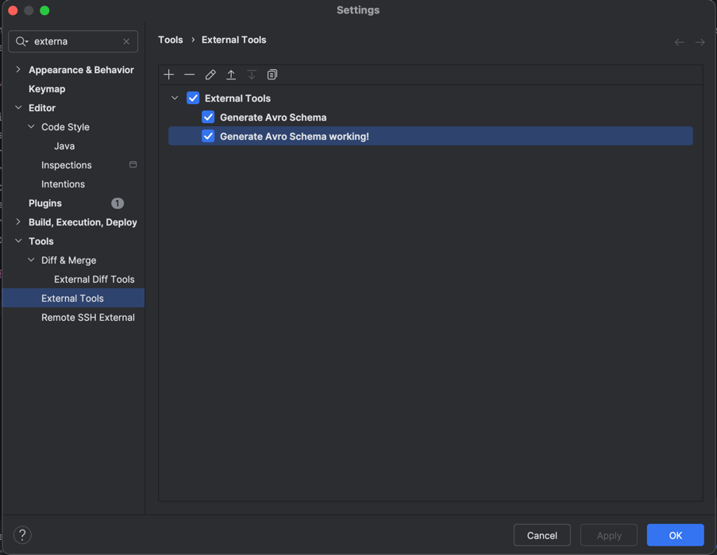

# Avro Schema Generator

## Overview

The Avro Schema Generator is a utility tool that automatically converts database views into Avro schema definitions (`.avsc` files). This tool helps bridge the gap between Java applications and Avro-based systems such as Apache Kafka with schema registries.

## Key Features

- **Automatic Schema Generation**: Converts Java classes to Avro schemas through reflection
- **Type Customization**: Provides special handling for Java types:
    - Proper String type representation with "avro.java.string" property
    - Support for Java timestamps with Kafka Connect compatibility
    - UUID conversion support
    - Decimal type conversion
- **Field Ordering**: Maintains the original field order from the Java class
- **Compatibility**: Generates schemas compatible with Kafka Connect data formats

## Setting up as an External Tool in IntelliJ IDEA

### Prerequisites
1. Clone this project
2. Run `mvn install` to install the tool in your local Maven repository

### Configuration Steps

1. Open IntelliJ IDEA settings and navigate to the "External Tools" section

   

2. Click the "+" button to add a new external tool with the following configuration:
    - **Name**: Choose a descriptive name
    - **Group**: External Tools
    - **Program**: `java`
    - **Arguments**:
      ```
      -jar /Users/<yourUser>/.m2/repository/com/bestseller/bestone/bi4/avroschemagenerator/gen-avro-schema-db/0.0.1-SNAPSHOT/gen-avro-schema-db-0.0.1-SNAPSHOT.jar $ProjectFileDir$   
      ```
      *Note: You may need to replace forward slashes with backslashes on Windows*
    - **Working directory**: `$ProjectFileDir$`

3. Open the Advanced Options and check "Open console for tool output"

### Usage

1. In any Java project, right-click on the left panel
2. Select the external tool you just created
3. The Avro schema will be generated in the same directory as where the `application-local.yml` file is located

### Important Notes

- **application-local.yml**: Ensure an `application-local.yml` file exists in the root of your project. This file should include database connection details and the views to be converted into Avro schemas.
- **KafkaSchemaProperties**: You can configure it as follows:
  ```yaml
  kafka-schema-gen:
    schema-gen-properties:
      - entity-short-name: Entity1
        topic-name: Topic1
        view-key-name: View1
        view-name: View1
        name-space: nameSpace
      - entity-short-name: Entity2
        topic-name: Topic2
        view-key-name: View2
        view-name: View2
        name-space: nameSpace
    create-schema: false
    create-topic: false

If this configuration is missing, the command line will prompt you to provide it interactively.